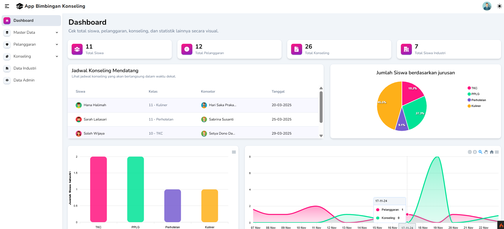
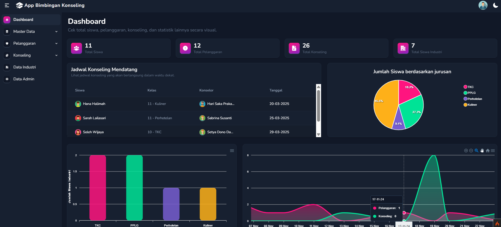

# App Bimbingan Konseling

## 📖 Ringkasan Proyek

App Bimbingan Konseling adalah aplikasi yang dirancang untuk membantu pengelolaan data siswa, guru, konselor, pelanggaran, konseling, dan industri dalam lingkungan sekolah. Aplikasi ini dilengkapi dengan fitur manajemen data, pencatatan riwayat pelanggaran siswa, serta jadwal konseling yang terintegrasi dengan kalender.

---
## 🖥️ Tampilan Awal (🌞 Light / 🌙 Dark)



---
## 🎯 Fitur

- **CRUD Lengkap:**
  - Data Siswa, Jurusan, Guru, Konselor, Pelanggaran, Konseling, Industri, dan Admin.
- **Riwayat Pelanggaran & Jadwal Konseling:**
  - Menampilkan riwayat pelanggaran siswa dan jadwal konseling yang mengintegrasikan dengan kalender.
- **Dashboard Interaktif:**
  - Ringkasan total siswa, pelanggaran, konseling, dan siswa industri.
  - Menampilkan jadwal konseling mendatang.
  - Chart interaktif dengan ApexCharts untuk:
    - Jumlah siswa berdasarkan jurusan.
    - Jumlah siswa industri berdasarkan jurusan.
    - Perbandingan siswa konseling dan pelanggaran.

---

## 🛠️ Teknologi yang Digunakan

- **Frontend:** HTML, CSS, TailwindCSS, JavaScript
- **Backend:** CodeIgniter 4 (CI4)
- **Build Tools:** Webpack
- **Chart Library:** ApexCharts.js
- **Database:** MySQL

---

## 📦 Cara Instalasi & Instruksi

### Persyaratan Awal:

Pastikan sudah terinstal:

- **Node.js** (untuk mengelola Tailwind dan Webpack)
- **Composer** (untuk dependensi CodeIgniter 4)

### Langkah Instalasi:

1. **Clone repository atau download ZIP:**

   ```bash
   git clone https://github.com/gusalitt/app-bimbingan-konseling.git
   cd app-bimbingan-konseling
   ```

2. **Install dependensi:**

   ```bash
   composer install
   npm install
   ```

3. **Setup file ****`.env`****:**

   - Salin file `.env.example` dan ubah namanya menjadi `.env`

   ```bash
   cp .env.example .env
   ```

   - Sesuaikan konfigurasi database dan environment di dalam file `.env`

4. **Migrasi Database:**

   - Buat database di MySQL sesuai dengan nama yang ada di `.env`.
   - Jalankan migrasi untuk membuat tabel:

   ```bash
   php spark migrate
   ```

5. **Jalankan Aplikasi:**

   ```bash
   php spark serve
   ```

### Untuk Pengembangan (Tailwind & Webpack):

- **Jika ingin mengubah atau menambahkan kodingan Tailwind, jalankan:**
  ```bash
  npm run dev
  ```
- **Jika melakukan perubahan pada konfigurasi Webpack atau ApexCharts, jalankan:**
  ```bash
  npm run build
  ```

---

## 🤝 Kontribusi

Kontribusi terbuka untuk siapa saja! Jika ingin berkontribusi:

- Fork repository ini.
- Buat branch baru (`git checkout -b feature-branch`).
- Commit perubahan (`git commit -m 'Deskripsi perubahan'`).
- Push branch dan buat pull request.
