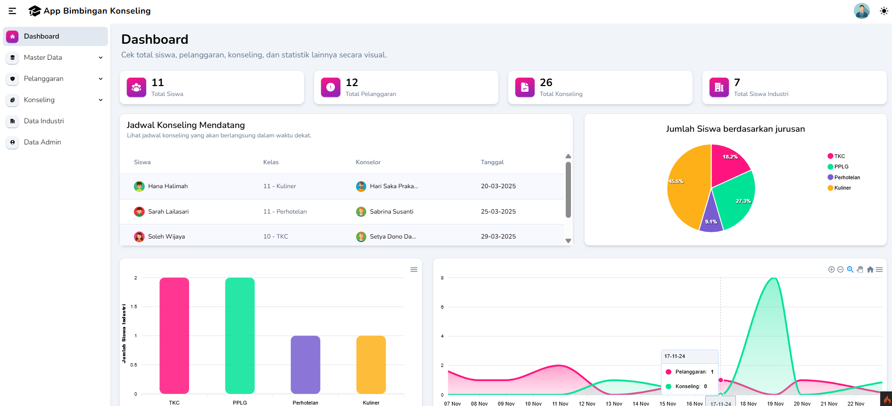
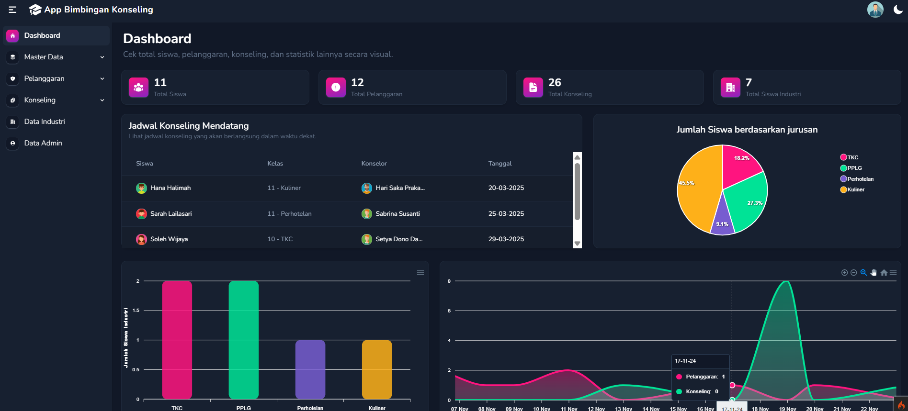

# App Bimbingan Konseling

The Guidance and Counselling App is an application designed to assist with the management of data relating to pupils, teachers, counsellors, disciplinary incidents, counselling sessions and industry matters within a school setting. The app features data management tools, a record of pupils’ disciplinary history, and a counselling schedule integrated with the calendar.

---
## Home Screen (Light / Dark)



---
## Feature

- **Full CRUD:**
  - Data on students, degree programmes, teachers, counsellors, disciplinary offences, counselling, industry placements and administration.
- **Disciplinary Record & Counselling Schedule:**
  - Displays the student’s disciplinary record and counselling schedule, integrated with the calendar.
- **Interactive Dashboard:**
  - Summary of total student numbers, disciplinary cases, counselling sessions and work-placement students.
  - Displays the schedule of upcoming counselling sessions.
  - Interactive charts using ApexCharts for:
    - Number of students by course of study.
    - Number of work-placement students by course of study.
    - Comparison of students receiving counselling and those involved in disciplinary cases.


---

## Technology Used

- **Frontend:** HTML, CSS, TailwindCSS, JavaScript
- **Backend:** CodeIgniter 4 (CI4)
- **Build Tools:** Webpack
- **Chart Library:** ApexCharts.js
- **Database:** MySQL

---

## Installation Guide & Instructions

### Entry Requirements:

Make sure the following are installed:

- **Node.js** (to manage Tailwind and Webpack)
- **Composer** (for CodeIgniter 4 dependencies)


### Installation Steps:

1. **Clone the repository or download the ZIP file:**

   ```bash
   git clone https://github.com/gusalitt/app-bimbingan-konseling.git
   cd app-bimbingan-konseling
   ```

2. **Install dependencies:**

   ```bash
   composer install
   pnpm install
   ```

3. **Setup file ****`.env`****:**

   - Copy the `.env.example` file and rename it to `.env`

   ```bash
   cp .env.example .env
   ```

   - Adjust the database and environment configurations in the file `.env`

4. **Database Migration:**

   - Create a database in MySQL with the name specified in `.env`.
   - Run the migration to create the table:

   ```bash
   php spark migrate
   ```

5. **Run the Application:**

   ```bash
   php spark serve
   ```